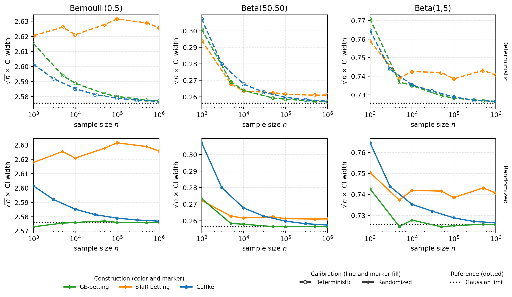

# GE-betting

Research code for **Gaussian-efficient testing by betting on the mean of
bounded data**, by Diego Martinez-Taboada and Aaditya Ramdas.

GE-betting constructs finite-sample-valid confidence intervals for the mean
of bounded observations by inverting terminal e-values.  Under iid sampling
with positive variance, its first-order width matches the Gaussian benchmark.
The repository contains the core implementations, all simulations used in the
paper, committed plotting summaries, and one command that redraws every
manuscript figure.



## Reproduce the paper figures

```bash
git clone https://github.com/DMartinezT/betting.git
cd betting

python3 -m venv .venv
source .venv/bin/activate
python -m pip install -r requirements.txt

python reproduce_paper_figures.py
```

The final command redraws all eleven figures used by the paper from committed
results and writes them to `paper_figures/`.  It does **not** rerun Monte Carlo
simulations.  To update a neighboring checkout of the manuscript directly:

```bash
python reproduce_paper_figures.py --output-dir ../paper/plots
```

List the exact figure manifest or verify its cached inputs with:

```bash
python reproduce_paper_figures.py --list
python reproduce_paper_figures.py --check-inputs
```

See [the reproducibility guide](docs/REPRODUCIBILITY.md) for the figure-to-code
map, selective regeneration, and full simulation commands.

## Installation

The publication environment uses Python 3.12 and the exact versions in
`requirements.txt`.  The code supports Python 3.11 or newer; an editable
installation with compatible dependency versions is also available:

```bash
python -m pip install -e .
```

The numerical stack is NumPy, SciPy, Numba, pandas, Matplotlib, and tqdm.  No
network access or external datasets are needed after the repository has been
cloned.

## Minimal use

The deterministic 99% fixed-horizon GE-betting interval can be computed as:

```python
import numpy as np

from betting import probit_common_clock_ci_endpoints

x = np.array([0.12, 0.41, 0.77, 0.33, 0.58])
lower, upper, empty = probit_common_clock_ci_endpoints(x, delta=0.01)
assert not empty
print(lower, upper)
```

For uniformly randomized Markov calibration, generate one independent pair
in `(0, 1]` and pass it through `randomizers=(u_plus, u_minus)`.  The same pair
must remain fixed over all candidate means in an inversion.

## Repository layout

```text
betting.py                         core fixed-horizon methods and inversions
confidence_sequences.py            core with-replacement CS methods
wor.py                              without-replacement methods and experiment
robust_studentized_dp.py            robust Studentized-event Bellman solver
legacy_constructions.py             archived constructions used for reproduction
reproduce_paper_figures.py          authoritative manuscript figure command
figures/                            plot-only manuscript figure helpers
experiments/                        simulation, audit, and diagnostic drivers
gaffke_comparison/                  Gaffke experiments and saved results
plots/                              committed results, summaries, and figures
tests/                              unit and reproduction-manifest tests
docs/REPRODUCIBILITY.md             exact manuscript workflow
docs/EXPERIMENTS.md                 primary and auxiliary experiment catalog
```

The root is reserved for core implementations and the single manuscript
figure command.  Individual research drivers live under `experiments/`, and
plot-only helpers live under `figures/`; both are cataloged in
[docs/EXPERIMENTS.md](docs/EXPERIMENTS.md).  Earlier exploratory figures and
their generators are retained, but only `reproduce_paper_figures.py` defines
the current manuscript figure set.

## Tests

Run the complete unit suite and validate all manuscript plotting inputs:

```bash
make check
```

Equivalently:

```bash
python -m unittest discover -s tests -t . -v
python reproduce_paper_figures.py --check-inputs
```

The suite covers martingale identities, nonnegativity, direct and mesh-based
inversions, topology diagnostics, confidence sequences, order-invariant
constructions, robust Studentized bounds, survival experiments, and the paper
figure manifest.

## Reproducibility policy

- Publication figures are redrawn from committed final summaries; checkpoint
  files are not required.
- Full experiments record seeds, horizon grids, replication counts, and
  method-specific settings alongside their results.
- External randomization uses RNG streams separate from the observations.
- Historical serialized result keys are preserved for compatibility, while
  current user-facing text consistently uses `GE-betting`.
- Plotting-only changes should use each driver's `--plot-only` mode whenever
  available.

## Citation

Please cite the companion paper:

> Diego Martinez-Taboada and Aaditya Ramdas. *Gaussian-efficient testing by
> betting on the mean of bounded data*. 2026.

Machine-readable citation metadata are provided in [CITATION.cff](CITATION.cff).
The arXiv identifier will be added after posting.

## License

No open-source license has yet been selected.  Until the authors add one,
standard copyright restrictions apply.
